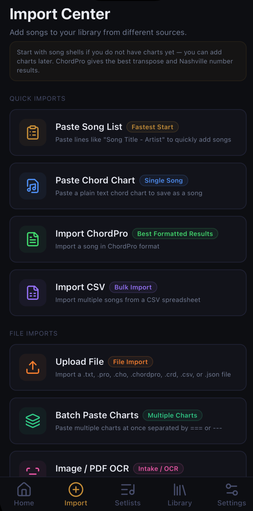
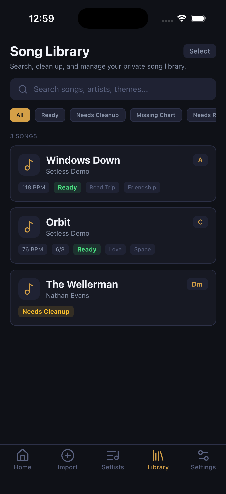
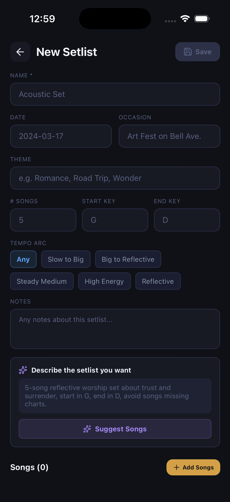
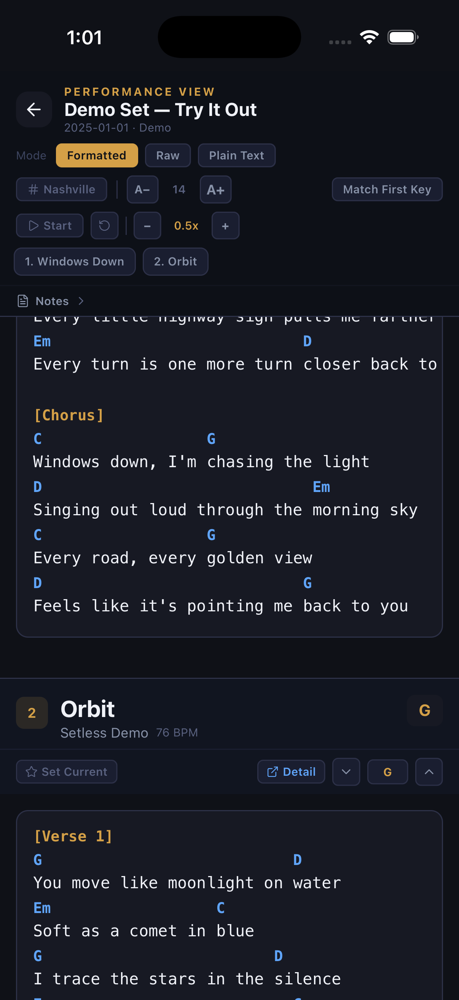
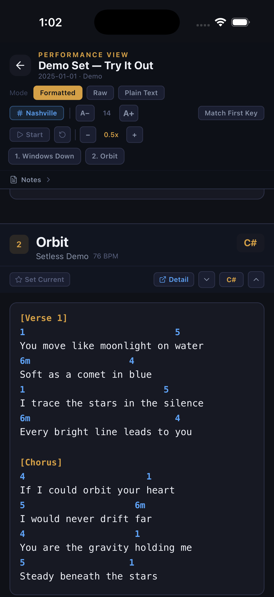

# Setless — Song Library & Setlist Design/Performance App

Setless helps musicians “set less” by organizing songs at the point of entry, not when a setlist is needed.

It is a music workflow application designed to turn a musician's private song library into structured, reusable information for setlist planning and live performance. The goal is to let technology handle more of the organizational work so the musician can remain focused on the creative work.

## App Preview

  

The home dashboard summarizes the state of the private library, including songs that are ready for performance and songs that still require review.

---

## Project Overview

Musicians often accumulate years of songs, chord charts, lyrics, screenshots, notes, performance ideas, and memories without a consistent system for organizing them.

Setless is designed around a simple principle:

**Organize at input, not when the setlist is needed.**

Rather than treating each performance as a new organizational project, Setless converts song information into structured records that can be searched, compared, transformed, and reused across performances.

The application combines:

- Structured song-library management
- Music theory metadata
- Data-quality and readiness indicators
- Setlist planning
- Chord transposition
- Nashville Number System conversion
- Live-performance tools
- Multiple song-import workflows
- A planned AI-assisted semantic recommendation workflow

---

## Problem

Musicians and artists often do messy work.

Songs, lyrics, chord charts, keys, performance notes, themes, and ideas may be spread across documents, screenshots, notes apps, websites, handwritten notes, or simply the musician's memory.

Because this information is unstructured and distributed across multiple places, it becomes difficult to:

- Search the musician's complete repertoire
- Compare songs while designing a performance
- Remember older or less frequently performed material
- Identify songs that fit an audience, theme, or intended experience
- Change keys quickly
- Maintain consistent chord charts
- Use digital tools effectively during setlist preparation

The problem is not necessarily a lack of songs. Often, the musician already has the material but cannot efficiently retrieve and evaluate it when it matters.

---

## Solution

Setless creates a private, structured song library that separates **information management** from **artistic judgment**.

The musician remains responsible for deciding what a performance means, which songs belong in it, and what should ultimately be communicated to an audience.

Setless handles more of the organizational work surrounding those decisions.

This includes importing songs from multiple formats, structuring musical metadata, tracking data quality, searching the library, creating setlists, transforming chord information, and providing performance-oriented tools.

A planned AI-assisted feature extends this idea by helping musicians rediscover songs already contained in their own private libraries.

Rather than relying only on exact keyword matching, the intended workflow will compare a user's desired theme, audience, or performance concept with the broader themes represented within their songs.

The goal is not to use AI as an art generator.

The goal is to use it for **organization, retrieval, and consideration** so that the musician remains the creative decision-maker.

---

# Workflow

## 1. Import and Structure the Data

Setless supports several methods of bringing song information into the private library.

  

Current and planned intake methods include:

- Pasted song lists
- Plain-text chord charts
- ChordPro files
- CSV bulk imports
- Supported file uploads
- Batch chord-chart imports
- Image/PDF intake workflows

The purpose of supporting multiple sources is to acknowledge that musicians rarely begin with perfectly standardized data.

The application is designed to accept that messy starting point and gradually convert it into consistent, reusable information.

---

## 2. Create a Structured Private Song Library

Once imported, songs become structured records rather than disconnected files or notes.

  

Song records can contain information such as:

- Song title
- Artist
- Musical key
- Tempo
- Time signature
- Lyrics
- Chords
- Themes
- Performance notes
- Data-quality/readiness status

The library also distinguishes between records that are ready for use and records that still need cleanup or missing information.

This reflects a basic data-quality principle: **not all records should be treated as equally complete or reliable.**

---

## 3. Design the Setlist

Setless allows musicians to define the context of a performance before selecting songs.

  

A setlist can be designed around information such as:

- Performance name
- Date
- Occasion
- Theme
- Number of songs
- Starting key
- Ending key
- Tempo arc
- Performance notes

### AI-Assisted Semantic Matching — In Development

The planned AI-assisted setlist feature is designed to go beyond literal keyword matching.

For example, a musician may request a set about:

> grief, hope, reconciliation, trust, or perseverance

A song may strongly express one of those ideas without ever containing that exact word.

The intended recommendation workflow will use the themes and characteristics of songs already stored in the musician's private library to surface potentially relevant material for consideration.

The musician will remain responsible for accepting, rejecting, reordering, or replacing those recommendations.

The objective is:

**AI-assisted discovery, not AI-generated artistry.**

---

## 4. Support Live Performance

Setless also provides tools designed for situations where musicians need to make decisions quickly during a performance.

  

Performance tools include:

- Lyrics and chord display
- Setlist navigation
- Auto-scroll
- Adjustable scrolling speed
- Immediate key changes
- Song-level performance controls
- Editable setlist workflow

The objective is to reduce the amount of attention required for administrative tasks while the musician is performing.

---

## 5. Transform Musical Data in Real Time

The same underlying song information can also be represented differently depending on the musician's needs.

  

Setless supports:

- Semitone-based chord transposition
- Rapid key changes
- Nashville Number System viewing
- Standard chord-symbol viewing

This allows the song data to remain consistent while its presentation changes for different musical contexts.

---

## Key Features

### Current / Prototype Functionality

- Private song-library organization
- Structured music theory metadata
- Multiple song-import workflows
- Searchable song library
- Data-quality/readiness indicators
- Setlist creation
- Lyrics and chord viewing
- Semitone-based chord transposition
- Nashville Number System conversion
- Auto-scroll for live performance
- Editable setlist workflow
- Setlist export functionality

### In Development

- AI-assisted thematic song discovery
- Semantic matching beyond exact keywords
- Audience- and theme-informed song recommendations
- Expanded import automation
- Additional library analytics and filtering

---

## Data & Product Design

Setless is also a data-design project.

The application takes information that may begin as:

**screenshots + documents + chord charts + spreadsheets + notes + memory**

and attempts to transform it into:

**structured records → standardized metadata → searchable library → decision-support workflow**

This required thinking about:

- What information should be captured
- Which fields should be standardized
- How incomplete records should be identified
- Which metadata is useful for decision-making
- How the same underlying data can support multiple outputs
- How users should interact with recommendations
- Where automation is useful
- Where human judgment should remain primary

---

## Skills Demonstrated

- Structured Data Organization
- Metadata Design
- Data Cleaning
- Data Quality Management
- Requirements Analysis
- Application Prototyping
- UX Workflow Design
- Semantic Search Concepts
- AI Feature Design
- Generative AI
- QA Testing
- User-Centered Design
- Responsible AI Design

---

## Responsible AI & Privacy

Musicians may reasonably be cautious about allowing AI systems to interact with original works, private song libraries, creative workflows, or personal information.

For that reason, privacy and user control are part of the product requirements rather than afterthoughts.

The intended role of AI within Setless is limited:

**help organize, retrieve, compare, and reconsider information that the musician has chosen to place in their own library.**

AI recommendations should remain suggestions.

The musician retains responsibility for artistic interpretation and the final setlist.

---

## Why This Project Matters

Setless demonstrates my ability to take an ambiguous real-world problem and translate it into structured data requirements, workflows, user interfaces, and decision-support functionality.

From a data analytics perspective, the project involves many of the same questions encountered in organizational data work:

- How do we turn messy inputs into usable data?
- What metadata should we collect?
- How do we identify incomplete records?
- How should information be organized for retrieval?
- How can technology surface useful relationships within the data?
- How do we validate whether recommendations are actually relevant?
- How do we present information so that we can make a better decision?

Future development will also allow the AI-assisted recommendation workflow to be evaluated quantitatively using measures such as relevance testing, false-positive analysis, false-negative analysis, precision, recall, and human validation.

The larger objective of Setless is simple:

**use technology to reduce organizational friction without removing the human judgment that gives the work meaning.**
