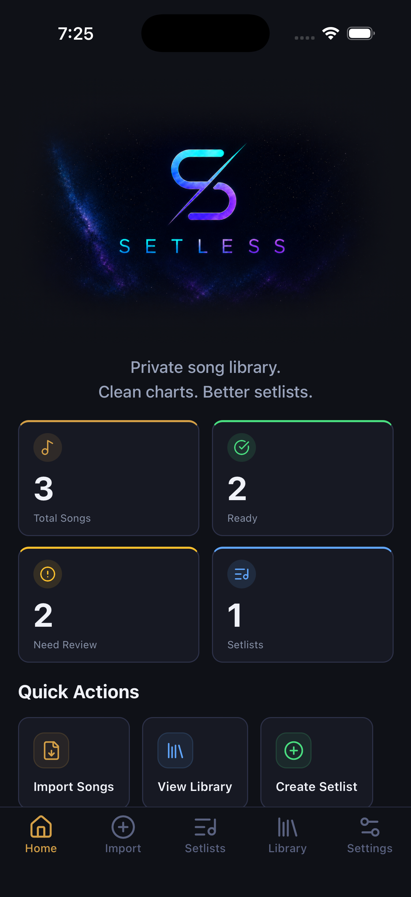

# Setless — Song Library & Setlist Design/Performance App

Setless helps musicians “set less” by organizing songs at the point of entry, not when a setlist is needed. It is a music workflow app designed to help musicians structure private song libraries, build setlists, and provide fast digital tools that support improvised changes during live performances.

## App Preview

## Project Overview

The Setless app organizes imported song libraries with structured music theory metadata and helps users build setlists based on audience, show theme, and song attributes.

## Problem

Musicians often manage songs, lyrics, chords, keys, and performance notes across scattered documents, screenshots, notes apps, and memory. This unstructured data preparation makes for a less impactful setlist for both the creative musician and the audience, and impedes the use of digital tool support in the artist's performance-crafting workflow.

## Solution

Setless creates a more organized workflow by turning the musician's private song library into structured, searchable, performance-ready information. This allows the artist to harness digital features like song recommendations for their setlist based on themes and target audiences with songs the artist already knows.

## Key Features

- Private song library organization
- Music theory metadata
- Setlist creation based on audience or show theme
- Lyrics/chords viewing
- Semitone-based chord transposition to support quick key changes
- Nashville Number System toggle for flexible chord chart viewing
- Auto-scroll for live performance
- Setlist export functionality
- Editable setlist workflow

## Skills Demonstrated

- Application prototyping
- Product requirements
- UX workflow design
- Structured data organization
- Data cleaning
- Metadata design
- QA testing
- User-centered design
- No-code/low-code development

## Why This Project Matters

This project shows my ability to take a real-world problem, break it into structured requirements, organize information around user needs, and build a practical tool that supports better decision-making and workflow efficiency.
